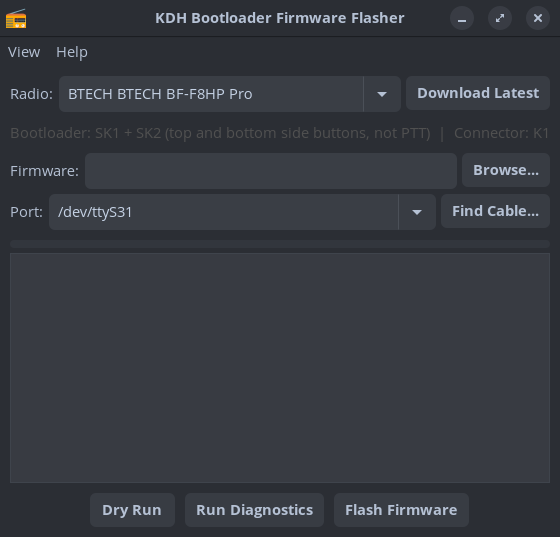
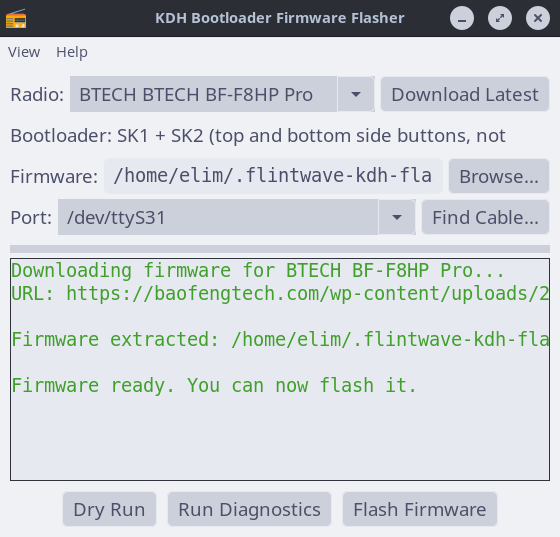

# FlintWave KDH Flasher

A cross-platform tool for flashing `.kdhx` firmware to radios that use the KDH bootloader — BTECH, Baofeng, Radtel, and others. No Wine or Windows VM needed.

Maintained by [FlintWave Radio Tools](https://github.com/FlintWave). Contact: flintwave@tuta.com




## Status

**Untested** — the protocol implementation has been verified via dry-run packet construction and CRC validation, but has not yet been confirmed on hardware. Community testing reports welcome — please open an issue.

## Download

### Standalone binaries (no Python needed)

Download the latest release for your OS:

- **[GitHub Releases](../../releases/latest)**
- **[Codeberg Releases](https://codeberg.org/flintwaveradio/flintwave-kdh-flasher/releases/latest)**

Extract and run — no installation required.

### Install from source

#### Linux (one-liner)

```
curl -sL https://raw.githubusercontent.com/FlintWave/flintwave-kdh-flasher/master/install.sh | bash
```

This installs dependencies, clones the repo, adds a desktop launcher, and sets up serial port access.

#### Linux (manual)

```bash
sudo apt install python3-wxgtk4.0 python3-serial python3-requests git
git clone https://github.com/FlintWave/flintwave-kdh-flasher.git
cd flintwave-kdh-flasher
python3 flash_firmware_gui.py
```

Add yourself to the `dialout` group for serial port access:
```
sudo usermod -aG dialout $USER
```
Log out and back in for the group change to take effect.

#### macOS

```bash
brew install python wxpython
pip3 install pyserial requests
git clone https://github.com/FlintWave/flintwave-kdh-flasher.git
cd flintwave-kdh-flasher
python3 flash_firmware_gui.py
```

#### Windows

1. Install [Python 3.10+](https://python.org) — **check "Add Python to PATH" during install**
2. Open Command Prompt and run:
```
py -m pip install pyserial wxPython requests
```
3. Download and extract the [ZIP](https://github.com/FlintWave/flintwave-kdh-flasher/archive/refs/heads/master.zip)
4. Run:
```
py flash_firmware_gui.py
```

Or download and run `install.bat` for an automated setup.

## Supported Radios

| Radio | Manufacturer | Tested |
|-------|-------------|--------|
| BF-F8HP Pro | BTECH | No |
| UV-25 Plus / UV-25 Pro | Baofeng | No |
| UV-17 Pro | Baofeng | No |
| UV-18 Pro | Baofeng | No |
| UV-21 Pro | Baofeng | No |
| RT-470 | Radtel | No |
| RT-490 | Radtel | No |
| JC-8629 | JJCC | No |

Radio definitions live in `radios.json` — community contributions welcome via PR.

## Features

- **GUI and CLI** interfaces
- **Radio selector** with per-model bootloader instructions
- **Firmware download** from manufacturer websites
- **Port finder wizard** with auto-detection of FTDI PC03 cables
- **Dry run mode** — verify firmware files without touching the radio
- **Serial diagnostics** — test cable and radio communication
- **Catppuccin themes** — Latte, Frappe, Macchiato, Mocha, High Contrast
- **Adjustable font sizes** for accessibility
- **Auto-update** from GitHub on launch
- **Test report submission** after flashing
- Cross-platform: Linux, macOS, Windows

## CLI Usage

### Flash firmware

```
python3 flash_firmware.py /dev/ttyUSB0 firmware.kdhx
```

### Dry run

```
python3 flash_firmware.py --dry-run none firmware.kdhx
```

### Diagnostics

```
python3 flash_firmware.py --diag /dev/ttyUSB0
```

## Protocol

The KDH bootloader uses a packetized serial protocol at 115200 baud (8N1).

### Packet format

```
[0xAA][cmd][seed][lenH][lenL][data...][crcH][crcL][0xEF]
```

CRC-16/CCITT (poly 0x1021, init 0x0000) over cmd+seed+len+data.

### Manual download sequence

| Step | Command | Byte | Payload |
|------|---------|------|---------|
| 1 | Handshake | 0x01 | `"BOOTLOADER"` (10 bytes) |
| 2 | Announce chunks | 0x04 | 1 byte: total 1024-byte chunks |
| 3 | Send data (repeat) | 0x03 | 1024 bytes per chunk |
| 4 | End | 0x45 | (none) |

### Error codes

| Code | Meaning |
|------|---------|
| 0xE1 | Handshake code error (fatal) |
| 0xE2 | Data verification error (retryable) |
| 0xE3 | Incorrect address error (fatal) |
| 0xE4 | Flash write error (fatal) |
| 0xE5 | Command error (fatal) |

## Contributing

- **Test reports** — flash your radio and submit a report (the app offers this after flashing)
- **New radios** — add your radio to `radios.json` and submit a PR
- **Bug fixes** — always welcome

## License

MIT
