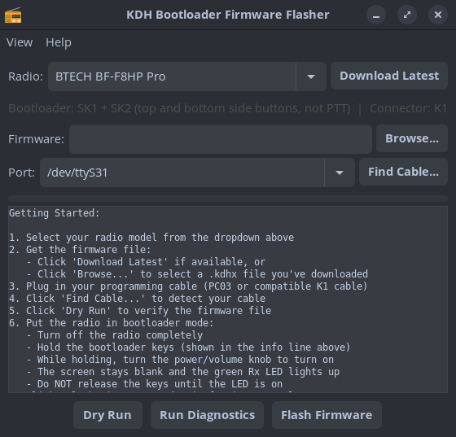
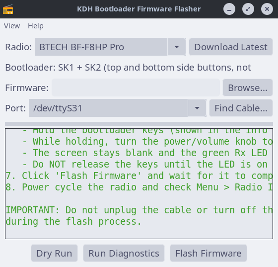

# FlintWave KDH Flasher

A cross-platform tool for flashing `.kdhx` firmware to radios that use the KDH bootloader — BTECH, Baofeng, Radtel, and others. Works on Linux, macOS, and Windows.

Maintained by [FlintWave Radio Tools](https://github.com/FlintWave). Contact: flintwave@tuta.com




## Status

**Tested** — successfully flashed BF-F8HP Pro (V0.53) on Linux. Community testing reports for other radios welcome — please open an issue.

## Download

### Installers (recommended)

Download from [GitHub Releases](https://github.com/FlintWave/flintwave-kdh-flasher/releases/latest):

| OS | Download | Install |
|----|----------|---------|
| Linux (Debian/Ubuntu/Pop!_OS/Mint) | [flintwave-kdh-flasher_amd64.deb](https://github.com/FlintWave/flintwave-kdh-flasher/releases/latest/download/flintwave-kdh-flasher_26.05.2_amd64.deb) | `sudo dpkg -i *.deb` |
| Linux (Fedora/RHEL/openSUSE) | [flintwave-kdh-flasher.x86_64.rpm](https://github.com/FlintWave/flintwave-kdh-flasher/releases/latest/download/flintwave-kdh-flasher-v26.05.2-1.x86_64.rpm) | `sudo rpm -i *.rpm` |
| Windows | [FlintWave-KDH-Flasher-Setup.exe](https://github.com/FlintWave/flintwave-kdh-flasher/releases/latest/download/FlintWave-KDH-Flasher-Setup.exe) | Run the installer |
| macOS | [FlintWave-KDH-Flasher.dmg](https://github.com/FlintWave/flintwave-kdh-flasher/releases/latest/download/FlintWave-KDH-Flasher.dmg) | Drag to Applications |

### Portable (no install)

| OS | Download | How to run |
|----|----------|-----------|
| Linux | [FlintWave-KDH-Flasher.AppImage](https://github.com/FlintWave/flintwave-kdh-flasher/releases/latest/download/FlintWave-KDH-Flasher-x86_64.AppImage) | `chmod +x` and double-click |
| Windows | [FlintWave-KDH-Flasher.exe](https://github.com/FlintWave/flintwave-kdh-flasher/releases/latest/download/FlintWave-KDH-Flasher.exe) | Double-click to run |

### Install from source

#### Linux (one-liner)

```
curl -sL https://raw.githubusercontent.com/FlintWave/flintwave-kdh-flasher/master/install.sh | bash
```

This installs dependencies, clones the repo, adds a desktop launcher, and sets up serial port access.

#### Linux (manual)

```bash
sudo apt install python3-wxgtk4.0 python3-serial python3-requests python3-rarfile unrar git
git clone https://github.com/FlintWave/flintwave-kdh-flasher.git
cd flintwave-kdh-flasher
python3 flash_firmware_gui.py
```

Add yourself to the `dialout` group for serial port access:
```
sudo usermod -aG dialout $USER
```
Log out and back in for the group change to take effect.

#### macOS

```bash
brew install python wxpython unrar
pip3 install pyserial requests rarfile
git clone https://github.com/FlintWave/flintwave-kdh-flasher.git
cd flintwave-kdh-flasher
python3 flash_firmware_gui.py
```

#### Windows

1. Install [Python 3.10+](https://python.org) — **check "Add Python to PATH" during install**
2. Open Command Prompt and run:
```
py -m pip install pyserial wxPython requests rarfile
```
3. Download and extract the [ZIP](https://github.com/FlintWave/flintwave-kdh-flasher/archive/refs/heads/master.zip)
4. Run:
```
py flash_firmware_gui.py
```

Or download and run `install.bat` for an automated setup.

## Supported Radios

| Radio | Manufacturer | Firmware Download | Tested |
|-------|-------------|-------------------|--------|
| BF-F8HP Pro | BTECH | Automatic | Yes |
| UV-25 Plus / UV-25 Pro | Baofeng | Automatic | No |
| RT-470 | Radtel | Automatic (live) | No |
| RT-490 | Radtel | Automatic (live) | No |
| Other KDH Radio | Generic | Manual (browse) | — |

The "Other KDH Radio" option works with any radio that uses the KDH bootloader — browse for a `.kdhx` file and flash it. Many radios from Abbree, Hamgeek, Socotran, JJCC, and other manufacturers use this bootloader.

Radio definitions live in `radios.json`. Firmware URLs are also tracked in `firmware_manifest.json`, which is fetched at runtime from GitHub — new firmware URLs can be published via PR without an app update. Radtel radios additionally get live firmware discovery by scraping the manufacturer's download page.

## Features

- **GUI and CLI** interfaces
- **Radio selector** with per-model bootloader instructions
- **Firmware download** from manufacturer websites with version tracking
- **Remote firmware manifest** — new firmware URLs published without app updates
- **Version comparison** — warns before flashing same or older firmware
- **Port finder wizard** with auto-detection of FTDI PC03 cables
- **Dry run mode** — verify firmware files without touching the radio
- **Serial diagnostics** — test cable and radio communication
- **Catppuccin themes** — Latte, Frappe, Macchiato, Mocha, High Contrast
- **Adjustable font sizes** for accessibility
- **Auto-update** from GitHub on launch
- **Test report submission** after flashing
- Cross-platform: Linux, macOS, Windows

## CLI Usage

### Flash firmware

```
python3 flash_firmware.py /dev/ttyUSB0 firmware.kdhx
```

### Dry run

```
python3 flash_firmware.py --dry-run none firmware.kdhx
```

### Diagnostics

```
python3 flash_firmware.py --diag /dev/ttyUSB0
```

## Protocol

The KDH bootloader uses a packetized serial protocol at 115200 baud (8N1).

### Packet format

```
[0xAA][cmd][seed][lenH][lenL][data...][crcH][crcL][0xEF]
```

CRC-16/CCITT (poly 0x1021, init 0x0000) over cmd+seed+len+data.

### Manual download sequence

| Step | Command | Byte | Payload |
|------|---------|------|---------|
| 1 | Handshake | 0x01 | `"BOOTLOADER"` (10 bytes) |
| 2 | Announce chunks | 0x04 | 1 byte: total 1024-byte chunks |
| 3 | Send data (repeat) | 0x03 | 1024 bytes per chunk |
| 4 | End | 0x45 | (none) |

### Error codes

| Code | Meaning |
|------|---------|
| 0xE1 | Handshake code error (fatal) |
| 0xE2 | Data verification error (retryable) |
| 0xE3 | Incorrect address error (fatal) |
| 0xE4 | Flash write error (fatal) |
| 0xE5 | Command error (fatal) |

## Contributing

- **Test reports** — flash your radio and submit a report (the app offers this after flashing)
- **New radios** — add your radio to `radios.json` and submit a PR
- **Firmware URLs** — found a new firmware version? Update `firmware_manifest.json` and submit a PR. The app fetches this file at runtime, so users get the new URL immediately
- **Bug fixes** — always welcome

## License

MIT
